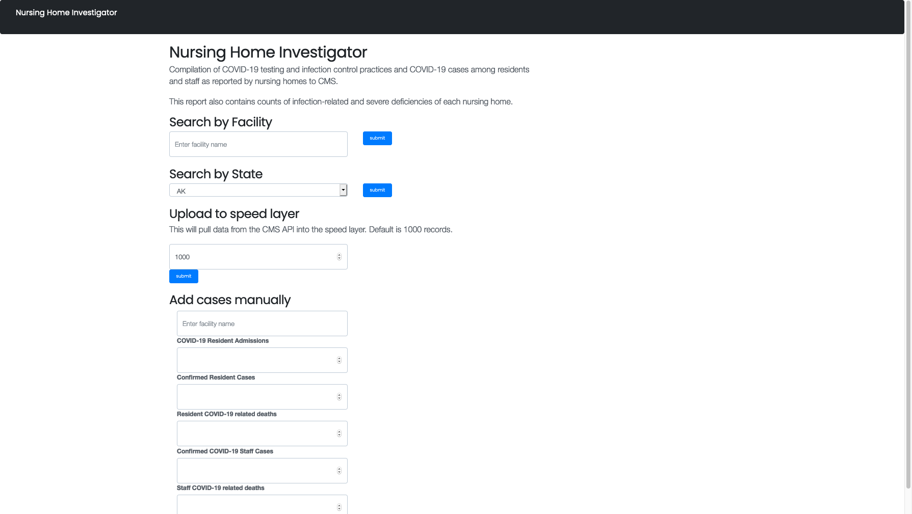
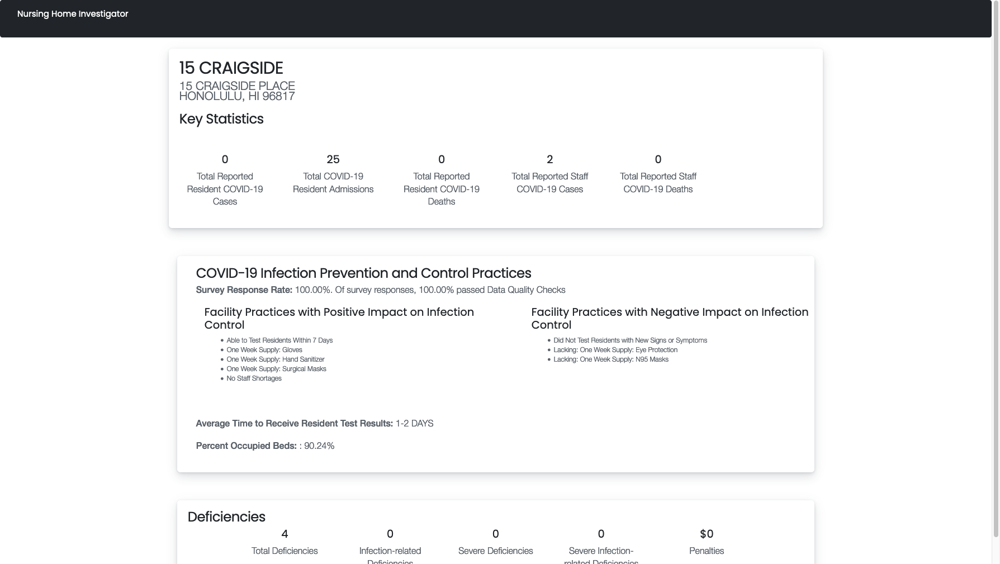
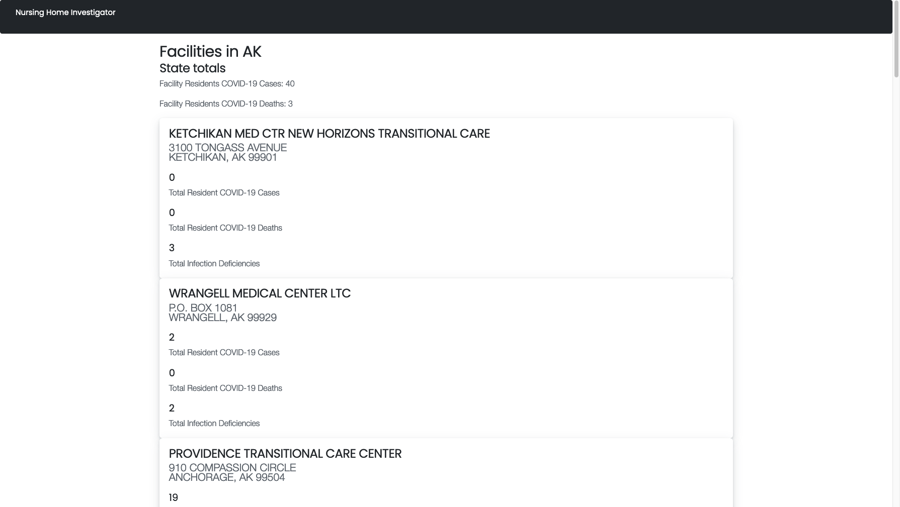

# Nursing Home Deficiencies and COVID-19 Cases

This project compiles COVID-19 Nursing Home report data with deficiencies and fines. The speed layer takes in input from the API on COVID-19 reports from the CMS COVID-19 Nursing Home Dataset. The user can also input new cases and submit a complaint (to be registered as a deficiency) to simulate speed layer data.

## Data Sources

* [Health Deficiencies](https://data.medicare.gov/Nursing-Home-Compare/Health-Deficiencies/r5ix-sfxw)
* [COVID-19 Nursing Home Dataset](https://data.cms.gov/Special-Programs-Initiatives-COVID-19-Nursing-Home/COVID-19-Nursing-Home-Dataset/s2uc-8wxp)
* [Fines](https://data.medicare.gov/Nursing-Home-Compare/Penalties/g6vv-u9sr)

NOTE: Since this project has started, [data.cms.gov](https://data.cms.gov) redesigned their website. See the readme in the deployment folder for more information.

Site is QuickDeployed on http://ec2-3-15-219-66.us-east-2.compute.amazonaws.com:3016/ and on load-balanaced servers at http://mpcs53014-loadbalancer-217964685.us-east-2.elb.amazonaws.com:3016/

Use the following spark-submit command to increment the data streamed from Kafka to the batch view table:

```bash
cd christiannenic/final_project/speedlayer/target
spark-submit --master local[2] --driver-java-options "-Dlog4j.configuration=file:///home/hadoop/ss.log4j.properties" --class StreamNursing uber-untitled-1.0-SNAPSHOT.jar b-1.mpcs53014-kafka.fwx2ly.c4.kafka.us-east-2.amazonaws.com:9092,b-2.mpcs53014-kafka.fwx2ly.c4.kafka.us-east-2.amazonaws.com:9092
```

I created separate READMEs for each layer of the application. Please review the README in each file for more information on the files within each folder, as well as notes/observations on building the application

## Folder Structure

* `data_ingestion`: Ingesting the files into HDFS. Also includes optional code for ingesting into S3.
* `batch-layer`: Data serialization, and building batch views.
* `web-app`: Web application
* `deployment`: packaged web app for deployment
* `speed-layer`: Building Kafka topic and spark-submit to increment batch view.

## Application Screenshots

Screenshots of the application:




